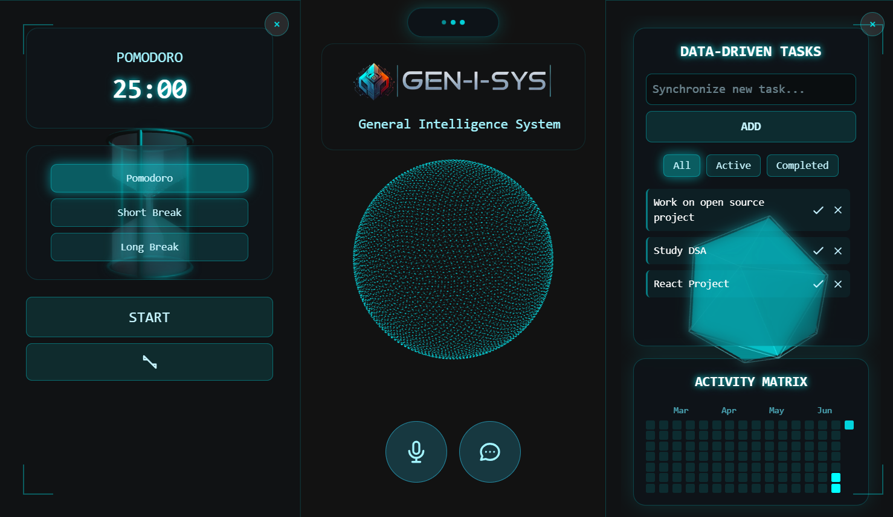

# GEN-I-SYS: The General Intelligence System


### 🖼️ Screenshots


**Main Interface**


GEN-I-SYS is a sophisticated, voice-activated AI assistant featuring a futuristic, heads-up display (HUD) style interface. It's designed to be an interactive and productive companion, integrating powerful tools like a Pomodoro timer and a task manager directly into the experience. The application leverages real-time audio processing and streaming, combined with stunning 3D visualizations, to create a truly immersive user experience.

---

### ✨ Key Features

*   **Real-time Voice Interaction**: Hands-free communication with the AI using browser-based SpeechRecognition and real-time audio streaming for responses.
*   **Immersive 3D Interface**: A dynamic particle sphere visualizes the AI's state, built with Three.js.
*   **Dynamic Island Navigator**: A sleek, modern navigation hub for accessing integrated tools.
*   **3D Pomodoro Timer**: A fully interactive hourglass with "energy sand" particles that correspond to the timer's progress.
*   **3D Task List & Activity Matrix**: Manage your tasks with a 3D crystal visualization that pulses on updates, and track your productivity with a GitHub-style activity heatmap.
*   **Responsive Design**: A seamless experience across desktop and mobile devices, with touch gestures and responsive UI adjustments.
*   **Efficient Audio Processing**: Utilizes `AudioWorklet` for high-performance, low-latency audio recording and playback in a separate thread.
*   **Real-time Communication**: Leverages Server-Sent Events (SSE) to stream text and audio data from the backend for a fluid, conversational feel.

---

### 🏛️ Architecture

The project is built with a modern client-server architecture:

*   **Frontend**: The user interface is built with vanilla **JavaScript**, **HTML5**, and styled with **Tailwind CSS**. **Three.js** is used for all 3D rendering. The frontend communicates with the backend via:
    *   `HTTP POST` requests to send user input (text or audio).
    *   `Server-Sent Events (SSE)` to receive a continuous stream of data (text and PCM audio) from the AI agent.
*   **Backend**: A **Python** server (likely using a framework like Flask or FastAPI) orchestrates the application.
    *   It serves the static frontend files.
    *   It provides API endpoints (`/send`, `/events`) to handle communication.
    *   The `ai_assistant` module processes user input and generates AI responses.

---

### 📁 Directory Structure

```
.
├── app/
│   ├── ai_assistant/       # AI agent logic
│   │   ├── agent.py
│   │   └── __init__.py
│   ├── static/             # Frontend assets
│   │   ├── assets/         # Images and sound effects
│   │   ├── js/             # JavaScript modules
│   │   │   ├── app.js      # Main application logic, SSE, audio handling
│   │   │   ├── components.js # Sidebar components (Pomodoro, Tasklist)
│   │   │   ├── audio-player.js
│   │   │   ├── audio-recorder.js
│   │   │   ├── pcm-player-processor.js # AudioWorklet for playback
│   │   │   └── pcm-recorder-processor.js # AudioWorklet for recording
│   │   ├── index.html      # Main HTML file
│   │   ├── pomodoro.html   # HTML structure for Pomodoro component
│   │   └── tasklist.html   # HTML structure for Tasklist component
│   ├── .env                # Environment variables
│   └── main.py             # Backend server entry point
├── .gitignore
└── requirements.txt        # Python dependencies
```

---

### 🚀 Getting Started

Follow these steps to get the project running locally.

#### Prerequisites

*   Python 3.8+
*   A modern web browser (Chrome, Firefox, Edge)

#### Installation & Setup

1.  **Clone the repository:**
    ```sh
    git clone https://github.com/AshishW/PROJECT_GEN-I-SYS.git
    cd <repo-name>
    ```

2.  **Set up a Python virtual environment:**
    ```sh
    python -m venv .venv
    source .venv/bin/activate  # On Windows, use `.venv\Scripts\activate`
    ```

3.  **Install dependencies:**
    ```sh
    pip install -r requirements.txt
    ```

4.  **Configure Environment Variables:**
    Create a `.env` file in the `app/` directory by copying the example if one is provided. Fill in any necessary API keys or configuration settings.

    .env:
    ```sh
    GOOGLE_GENAI_USE_VERTEXAI=FALSE
    GOOGLE_API_KEY= <ADD_YOUR_GEMINI_API_KEY> 
    ```

5.  **Run the application:(after cd app)**
    ```sh
    uvicorn main:app --reload
    ```
    If you get errors for browsing feature run the command without `--reload`

    ```sh
    uvicorn main:app
    ```

6.  **Open in your browser:**
    Navigate to `http://127.0.0.1:8000` or `http://localhost:8000` (or the port specified in your terminal).

---

### 🎮 How to Use

*   **Activate the Assistant**: Click the mic button on the main screen to start the voice assistant. You will need to grant microphone permissions.
*   **Navigate Tools**: Hover over the "Dynamic Island" at the top of the screen to reveal links to the **Pomodoro** timer and **Task List**.
*   **Open Sidebars**: Click the icons in the Dynamic Island to open the respective tools in a sidebar.
*   **Keyboard Shortcuts**:
    *   `Alt + P`: Toggle the Pomodoro timer sidebar.
    *   `Alt + T`: Toggle the Task List sidebar.
    *   `Esc`: Close any open sidebars.

---


